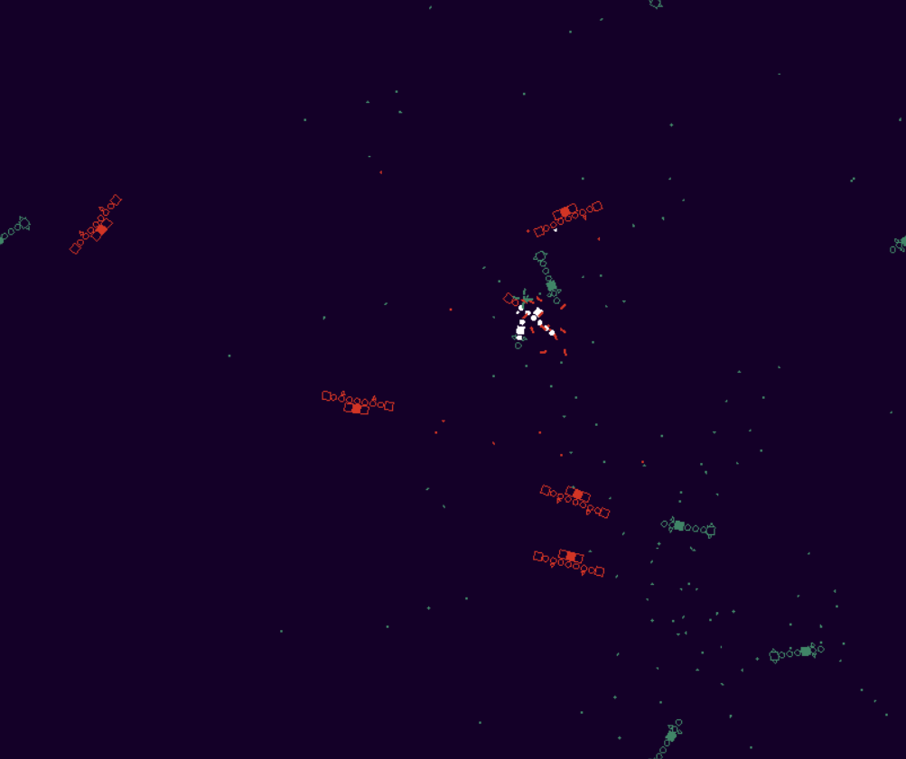
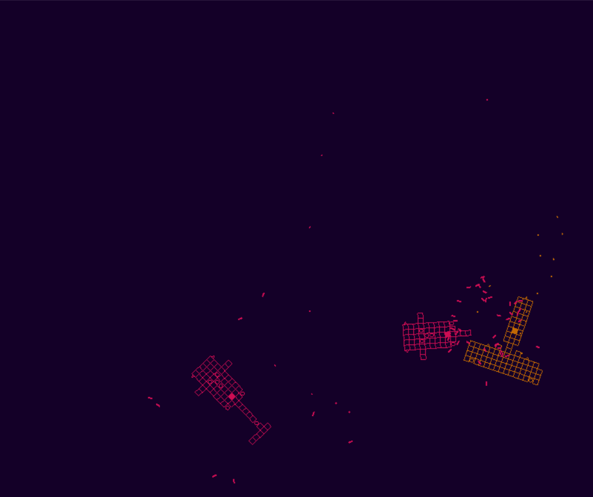

**Gladiator Ships**

This simple program was made in C# using Visual Studios. It's a simple simulation without interaction. Ships are procedurally generated using a number of rules and limited parts. These ships then fight on teams and the winning side goes to the next round.

The physics, rendering, and AI are all created from scratch.

**Email**
jacob.i.marks96@gmail.com

jacob.marks@student.nmt.edu

**LinkedIn**
https://www.linkedin.com/in/jacob-marks-766008147/
